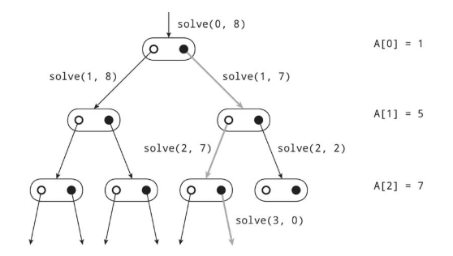

# :ledger: 全探索.

:pushpin:**全探索の特徴.**
- 数列の要素を選ぶ組み合わせを列挙するアルゴリズム.
- 再帰関数の中で2つの再帰関数を呼び出せば計算量O(2^n)となる.

:pushpin:**全探索の手順.**

:one:solve(i,m)において与えられた整数を作ることが出来た場合はmが0となる.  
:two:mが0より大きくiがn以上、またはmが0より小さくなった時は整数が作れなかった.  
:three:solve(i + 1, m)かsolve(i + 1, m - S[i])のいずれかがtrueの時に作れる.

数列A={1,5,7}に対して、8が作れるかを判定する例.



```cpp
#include <iostream>

using namespace std;

int S[] = {1, 2, 3, 5, 6, 7, 8, 11, 19, 20, 44, 90};
int n = 12;

int solve(int i, int m) {
    
    if (m == 0) {
        return 1;
    }
    if (i >= n) {
        return 0;
    }
    int res = solve(i + 1, m) || solve(i + 1, m - S[i]);
    return res;
}

int main(int argc, char** argv) {
    
    int T[] = {3, 13, 300};
    int q = 3;
    
    for (int i = 0; i < q; i++) {
        if (solve(0, T[i])) {
            cout << "Yes." << endl;
        } else {
            cout << "No." << endl;
        }
    }
    return 0;
}
```

:mag_right:対象ソースは以下に格納.
```
/source/4.recursion/allsearch.cpp
```