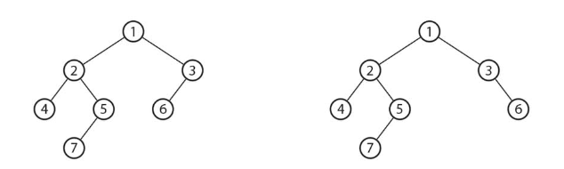
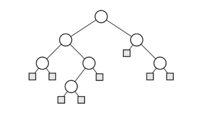

# :green_book: 二分木.

:pushpin:**二分木の特徴.**
- 1つの根を持ち全ての節点についてその子の数が2以下である木が根付き二分木.
- 各節点を1度ずつ訪問するので計算量O(n)となる.



:pushpin:**二分木の構造.**

:one:節点の数に変化がない二分木では、節点が子を持たない場合にはNILを設定し、番兵の役割を担う.



高さを求めるアルゴリズムは左の子の高さ+1と右の子の高さ+1の大きい方を節点とする.
```cpp
int setHeight(int u) {
    int h1 = 0, h2 = 0;
    // 左の子の高さ+1
    if (T[u].left != NIL) {
        h1 = setHeight(T[u].left) + 1;
    }
    // 右の子の高さ+1
    if (T[u].right != NIL) {
        h2 = setHeight(T[u].right) + 1;
    }
    return H[u] = (h1 > h2 ? h1 : h2);
}
```
根付き二分木Tの各節点uの各種情報を出力するプログラム.
```cpp
#include <iostream>

#define MAX 10000
#define NIL - 1

struct Node {int parent, left, right;};
Node T[MAX];
int n, D[MAX], H[MAX];

using namespace std;

void setDepth(int u, int d) {
    if (u == NIL) return;
    D[u] = d;
    setDepth(T[u].left, d+1);
    setDepth(T[u].right, d+1);
}

// 節点uの兄弟を返す
int getSibling(int u) {
    if (T[u].parent == NIL) {
        return NIL;
    }
    if (T[T[u].parent].left != u && T[T[u].parent].left != NIL) {
        return T[T[u].parent].left;
    }
    if (T[T[u].parent].right != u && T[T[u].parent].right != NIL) {
        return T[T[u].parent].right;
    }
    return NIL;
}

void print(int u) {
    
    printf("node %d: ", u);
    printf("parent = %d: ", T[u].parent);
    printf("sibling = %d: ", getSibling(u));
    
    // 節点の子の数
    int deg = 0;
    if (T[u].left != NIL) {
        deg++; // 子要素の追加
    }
    if (T[u].right != NIL) {
        deg++; // 子要素の追加
    }
    
    printf("degree %d: ", deg);
    printf("depth = %d: ", D[u]);
    printf("height = %d: ", H[u]);
    if (T[u].parent == NIL) {
        printf("root/n");
    } else if (T[u].left == NIL && T[u].right == NIL) {
        printf("leaf/n");
    } else {
        printf("internal node/n");
    }
}

// 二分木の表現
int main(int argc, char** argv) {
    
    int v, l, r, root = 0;
    
    int n = 9;
    for (int i = 0; i < n; i++) {
        T[i].parent = NIL;
    }
    
    // 二分木を表現
    // v:id(節点の番号) l:left(左要素の番号) r:right(右要素の番号)
    for (int i = 0; i < n; i++) {
        scanf("%d %d %d", &v, &l, &r);
        T[v].left = l;
        T[v].right = r;
        if (l != NIL) {
            T[l].parent = v;
        }
        if (r != NIL) {
            T[r].parent = v;
        }
    }
    
    // root要素の検索
    for (int i = 0; i < n; i++) {
        if (T[i].parent == NIL) {
            root = i;
        }
    }
    
    setDepth(root, 0);
    setHeight(root);
    
    for (int i = 0; i < n; i++) {
        print(i);
    }
    return 0;
}
```

:mag_right:対象ソースは以下に格納.
```
/source/6.tree/binary.cpp
```
