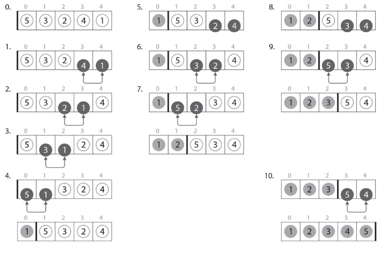

# :closed_book: バブルソート.

:pushpin:**バブルソートの特徴.**
- 安定なソートアルゴリズムだが計算量O(n^2).

:pushpin:**バブルソートの手順.**

挿入ソート同様に[ソート済みの部分列]と[未ソートの部分列]に分けられる.

:one:配列の末尾から隣接する要素を順番に比べ、大小関係が逆の場合は入れ替える.



```cpp
#include <iostream>

using namespace std;

// バブルソート
void bubble(int A[], int N) {
    
    // i:未ソート部分の先頭インデックス.
    for (int i = 0; i < N; i++) {
        // j:未ソート部分の隣り合う要素を比較するインデックス.
        // 配列Aの末尾(N-1)からi+1までを移動.
        for (int j = N - 1; j >= i + 1; j--) {
            // 隣り合う要素を比較.
            if (A[j] < A[j - 1]) {
                int tmp = A[j];
                A[j] = A[j - 1];
                A[j - 1] = tmp;
            }
        }
    }
}
```

:mag_right:対象ソースは以下に格納.
```
/source/1.sort/bubble.cpp
```