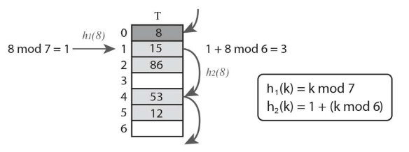

# :blue_book: ハッシュ法.

:pushpin:**ハッシュ法の特徴.**
- 各要素の値に対応するキーを管理するハッシュテーブルで動的な挿入・検索・削除を行うデータ構造.
- ハッシュテーブルはm個の要素を持つ配列Tとデータのキーから配列の添え字を決定する関数で構成.

:pushpin:**ハッシュ法の手順.**

ハッシュテーブルは以下のように実装できる.

```cpp
insert(data)
  T[h(data.key)] = data

search(data)
  return T[h(data.key)]
```

ハッシュ関数h(k)はkの値から配列Tの添え字を求める関数で、返す値はハッシュ値と呼ばれる.

ハッシュ値は0～m-1の値を取る必要があるので、***h(k) = k mod m*** を用いることができる.

ただしハッシュ値の衝突が起きる可能性があるので、オープンアドレス法などの対策が考えられる.

***H(k) = h(k,i) = (h1(k) + i x h2(k)) mod m***

このアルゴリズムでは衝突が起きる限り h(k,0), h(k,1), h(k,2)...と計算.



衝突が起きなかった最初のh(k,i)をハッシュ値として返却.

```cpp
h1(key)
  return key mod m

h2(key)
  return 1 + (key mod (m - 1))

h(key, i)
  return (h1(key) + i * h2(key)) mod m

insert(T, key)
  i = 0
  while true
    j = h(key, i)
    if T[j] == NIL
      T[j] = key
      return j
    else
      i = i + 1

search(T, key)
  i = 0
  while true
    j = h(key, i)
    if T[j] == key
      return j
    else if T[j] == NIL or i >= m
      return NIL
    else
      i = i + 1
```

:mag_right:対象ソースは以下に格納.
```
// なし
```