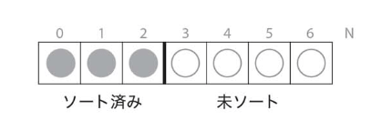
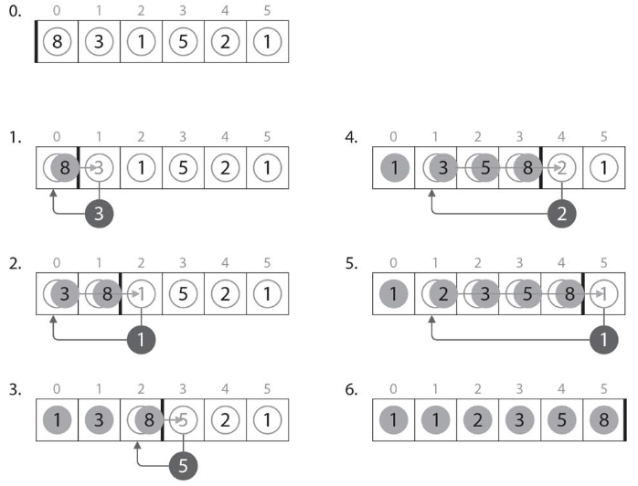

# :closed_book: 挿入ソート.

:pushpin:**挿入ソートの特徴.**
- 安定なソートアルゴリズムだが計算量O(n^2)となる.
- ある程度整列されたデータに対しては高速に動作.

:pushpin:**挿入ソートの手順.**

:one:先頭(左側)の要素はソート済みと見なす.  


:two:未ソート部分が無くなるまで以下の処理を繰り返す.  
-- :one:未ソート部分(右側)の先頭から要素を1つ取り出しvに記録.  
-- :two:ソート済みの部分において、vより大きい要素を後方へ1つずつ移動.  
-- :three:最後に空いた位置に「取り出した要素v」を挿入.  



```cpp
// 挿入ソート
void insert(int A[], int N) {
    
    int i; // 未ソートの部分列の先頭を表すループ変数.
    int v; // A[i]の値を一時的に保持しておくための変数.
    int j; // ソート済み部分列からvを挿入するための位置を探すループ変数.
    
    // 先頭要素[0]はソート済みとみなすためi=1から開始.
    for (i = 1; i < N; i++) {

        v = A[i]; // 未ソート部分の先頭要素[i]をvに一時保存.
        j = i - 1;

        // ソート済みの部分列の後方から大小比較を繰り返す.
        // ソート済み要素(A[j])が未ソート要素(v)より大きい場合は入れ替え
        while (j >= 0 && A[j] > v) {
            A[j + 1] = A[j];
            j--;
        }
        A[j + 1] = v;
        trace(A, N);
    }
}
```

:mag_right:対象ソースは以下に格納.
```
/source/1.sort/insert.cpp
```