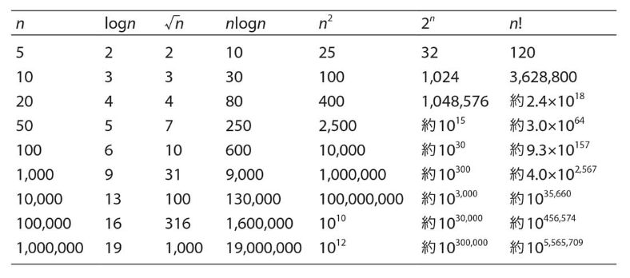

# :mortar_board: 導入.

:computer:**アルゴリズムとは!?**

データ処理、数値演算、組み合わせ計算、シミュレーションなどの問題を解決するための手順.

:computer:**計算量の評価.**

アルゴリズムの効率は主に以下の2つの計算量で評価される.

:one:時間計算量：プログラムの実行に必要な時間で評価.  
:two:領域計算量：プログラムの実行に必要な領域で評価.

:computer:**計算量の比較.**

アルゴリズムの評価で知られるオーダーについて、入力サイズnと計算量の比較.

