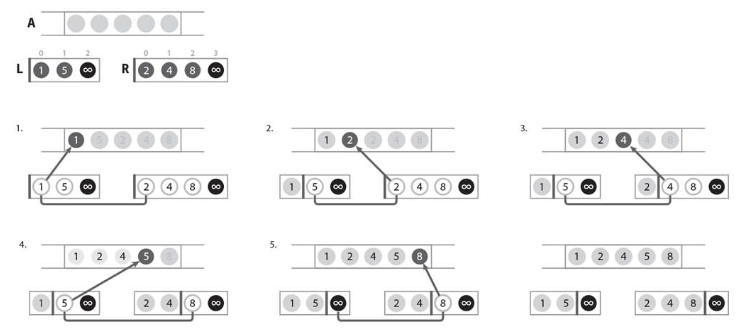
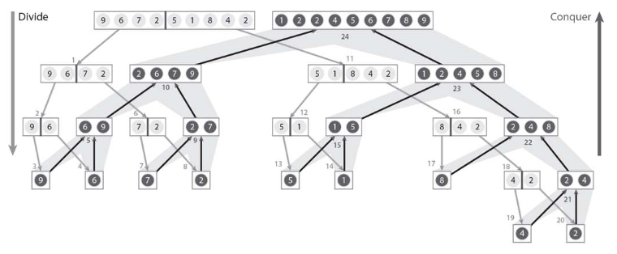

# :closed_book: マージソート.

:pushpin:**マージソートの特徴.**
- 指定要素を部分配列に分解してソート.  
- 最後にソート済み配列をマージするので計算量O(nlogn).

:pushpin:**マージソートの手順.**  

:one:配列全体を対象としてmergeSortを行う.  
:two:mergeSortは以下のとおり.  
-- :one:指定のn個の要素を含む部分配列をそれぞれn/2個の要素を含む2つの部分配列に分割.  
-- :two:その2つの部分配列をそれぞれmergeSortでソート.  
-- :three:得られた2つのソート済み部分配列をmergeにより統合.

整列済み配列L={1,5}とR={2,4,8}をマージする場合は以下のとおり.

  

配列{9,6,7,2,5,1,8,4,2}に対してマージソート行う場合は以下のとおり.

  

指定要素をn/2に分割していく.

```cpp
// マージソート
void mergeSort(int A[], int n, int left, int right) {
    
    if (left+1 < right) {
        int mid = (left + right) / 2;
        mergeSort(A, n, left, mid);
        mergeSort(A, n, mid, right);
        merge(A, n, left, mid, right);
    }
}
```

得られた2つのソート済み部分配列をマージ.

```cpp
#include <iostream>

using namespace std;

#define MAX 500000
#define SENTINEL 200000000

int L[MAX/2+2], R[MAX/2+2];
int cnt;

void merge(int A[], int n, int left, int mid, int right) {
    
    // 部分配列に入れ替え
    int n1 = mid - left;
    for (int i = 0; i < n1; i++) {
        L[i] = A[left + i];
    }
    int n2 = right - mid;
    for (int i = 0; i < n2; i++) {
        R[i] = A[mid + i];
    }
    
    // 番兵の設定
    L[n1] = R[n2] = SENTINEL;
    
    int i = 0, j = 0;
    for (int k = left; k < right; k++) {
        cnt++;
        // 分割された最小要素同士を比較
        if (L[i] <= R[j]) {
            A[k] = L[i++];
        } else {
            A[k] = R[j++];
        }
    }
}
```

:mag_right:対象ソースは以下に格納.
```
/source/5.hsort/merge.cpp
```