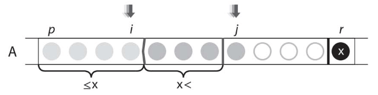
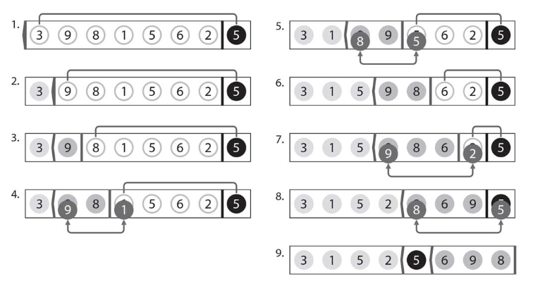

# :closed_book: パーティション.

:pushpin:**パーティションの特徴.**
- jがpからr-1まで毎回1回つ後方に移動するので、計算量O(n)のアルゴリズム.

:pushpin:**パーティションの手順.**
- 配列Aのpatitionの範囲はpからr(それぞれ含む)まで.
- partitionの基準となるA[r]をxと設定.
- x以下の要素はp〜iまでの範囲に、xより大きい要素はi+1〜jまでの範囲に移動させる.

  

数列{3,9,8,1,5,6,2,5}に対してpartitionを行う場合は以下のとおり.

  

パーティションは離れた要素を交換するので、ソートに応用する場合には注意が必要.
```cpp
#include <iostream>

using namespace std;

int A[] = {13, 19, 9, 5, 12, 8, 7, 4, 21, 2, 6, 11};
int n = 12;

// 基準となるx以下の要素がpからiまでの範囲(iを含む)
// xより大きな要素がi+1からjまでの範囲(jを含まない)
int partition(int p, int r) {
    
    // 基準値は最後方要素
    int x = A[r];
    // グループ1(x以下の要素)中の最大Idx
    int i = p - 1;
    // グループ2(xより大きい要素)中の最大Idx-1
    int j;
    
    // 毎回の計算ステップでは必ずjを+1してA[j]をどちらのグループに属するか判定
    int t;
    for (j = p; j < r; j++) {
        // A[j]がx以下の場合、A[j]とA[i]を交換
        if (A[j] <= x) {
            i++;
            t = A[i];
            A[i] = A[j];
            A[j] = t;
        }
        
        // A[j]がxよりも大きい場合、要素の移動はなし
    }
    t = A[i + 1], A[i + 1] = A[r]; A[r] = t;
    return i + 1;
}
```

:mag_right:対象ソースは以下に格納.
```
/source/5.hsort/partition.cpp
```