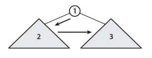
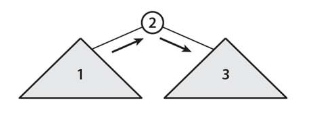
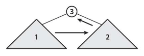

# :green_book: 木の巡回.

:pushpin:**木の巡回の特徴.**
- 二分木の巡回は木の各節点を1度ずつ訪問するので計算量O(n)となる.
- 再帰を用いた巡回アルゴリズムでは木の節点のバランス次第で再帰が深くなりすぎる可能性有り.

:pushpin:**木の巡回の構造.**

:one:根節点、左部分技、右部分技の順に巡回するアルゴリズムは木の先行順巡回.



```cpp
/* 先行順巡回 */
void preParse(int u) {
    if (u == NIL) return;
    printf(" %d", u); // 根節点
    preParse(T[u].l); // 左部分木
    preParse(T[u].r); // 右部分木
}
```

:two:左部分技、根節点、右部分技の順に巡回するアルゴリズムは木の中間順巡回.



```cpp
/* 中間順巡回 */
void inParse(int u) {
    if (u == NIL) return;
    inParse(T[u].l);  // 左部分木
    printf(" %d", u); // 根節点
    inParse(T[u].r);  // 右部分木
}
```

:three:左部分技、右部分技、根節点の順に巡回するアルゴリズムは木の後行順巡回.



```cpp
/* 後行順巡回 */
void postParse(int u) {
    if (u == NIL) return;
    postParse(T[u].l); // 左部分木
    postParse(T[u].r); // 右部分木
    printf(" %d", u);  // 根節点
}
```
最後に木構造を構築するアルゴリズム.
```cpp
#include <iostream>

#define MAX 10000
#define NIL - 1

using namespace std;

struct Node { int p, l, r; };
struct Node T[MAX];
int n; // 節点の数

int main(int argc, char** argv) {
    
    int v;    // 節点
    int l;    // 左要素
    int r;    // 右要素
    int root; // ルート要素
    
    n = 9;
    for (int i = 0; i < n; i++) {
        T[i].p = NIL;
    }
    
    // 木構造構築
    for (int i = 0; i < n; i++) {
        scanf("%d %d %d", &v, &l, &r);
        T[v].l = l;
        T[v].r = r;
        if (l != NIL) {
            T[l].p = v;
        }
        if (r != NIL) {
            T[r].p = v;
        }
    }
    
    // ルート要素
    for (int i = 0; i < n; i++) {
        if (T[i].p == NIL) {
            root = i;
        }
    }
    
    preParse(root);
    inParse(root);
    postParse(root);
    return 0;
}
```

:mag_right:対象ソースは以下に格納.
```
/source/6.tree/patrol.cpp
```