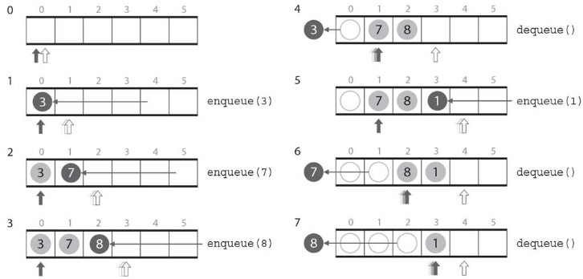
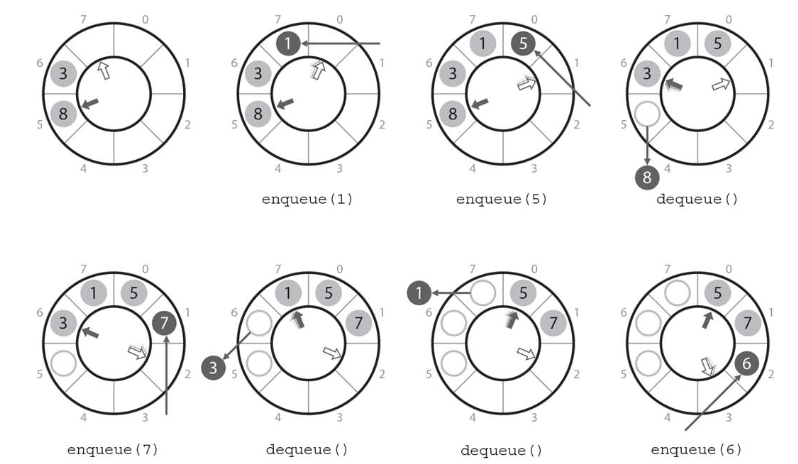

# :orange_book: キュー.

:pushpin:**キューの特徴.**
- 「待ち行列」とも呼ばれ、データの到着順に処理したい時に使用するデータ構造.
- データの中で最初に入ったものが最初に取り出されるFIFOの原則に従ったデータ構造.

:pushpin:**キューの手順.**

:one:enqueue(x):キューの末尾に要素xを追加.  
:two:dequeue():キューの先頭から要素を取り出す.  
:three:isEmpty():キューが空かどうかを調べる.  
:four:isFull():キュー満杯かどうかを調べる.  

追加と取り出しが繰り返されることで、headとtailに挟まれたデータ本体が末尾に向かって移動.



この操作を繰り返していると、tailとheadが配列の容量を超えてしまう.
- tailが配列の領域を超えた時点でオーバーフローで追加を諦めると容量が勿体無い.
- dequeue()実行の都度、headを常に0に保つよう配列を先頭に移動すると毎度計算量O(n)が必要.

これを解決する方法が配列をリングバッファとみなしてデータを管理する方法.



:mag_right:対象ソースは以下に格納.
```
// なし
```