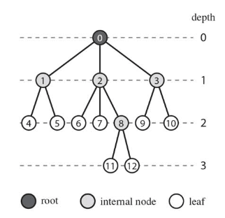

# :green_book: 根付き木. 

:pushpin:**根付き木の特徴.**
- 節点(node)と節点同士を結ぶ辺(edge)で表されるデータ構造.
- 木の高さをhとすると、深さを再帰的に計算するアルゴリズムは計算量O(n).



:pushpin:**根付き木の手順.**

:one:構造体Node{int p, l, r;}で左子右兄表現.  
:two:節点uの深さはuからその親を辿り、根に至るまでの辺の数を計算.  
:three:節点uの子のリストは、uの左の子から開始し、右の子が存在する限り右の子を辿ることで出力.

```cpp
#include <iostream>

using namespace std;

#define MAX 100005
#define NIL - 1

// 左子右兄弟表現
// p:節点uの親 l:節点uの最も左要素 r:節点uのすぐ右要素
struct Node {int p, l, r;};
Node T[MAX];

int n, D[MAX];

// 節点の深さ算出.
// 右の兄弟の深さ、最も左の子の深さを再帰的に算出.
// 右の兄弟が存在する場合は深さpを変えずに再帰的に呼び出し.
// 左の子が存在する場合は深さを1つ足して再帰的に呼び出し.
int rec(int u, int p) {
    D[u] = p;
    if (T[u].r != NIL) {
        // 右の兄弟に同じ深さを設定
        rec(T[u].r, p);
    }
    if (T[u].l != NIL) {
        // 最も左の子に自分の深さ+1を設定
        rec(T[u].l, p + 1);
    }
}
```
木構造を構築後、深さを再帰的に計算するアルゴリズムを実装.
```cpp
void print(int u) {
    int i, c;
    cout << "node " << u << ": ";
    cout << "parent " << T[u].p << " ";
    cout << "depth " << D[u] << ", ";
    
    if (T[u].p == NIL) {
        cout << "root, ";
    } else if (T[u].l == NIL) {
        cout << "leaf, ";
    } else {
        cout << "internal node, ";
    }
    
    cout << "[";
    
    for (i = 0, c = T[u].l; c != NIL; i++, c = T[c].r) {
        if (i) {
            cout << ", ";
        }
        cout << c;
    }
    cout << "]" << endl;
}

int main(int argc, char** argv) {

    int n = 13; // 木構造の節点数
    int depth;  // 深さ
    int child;  // 子要素
    int left;   // 左要素
    int right;  // 右要素
    int v, i;
    
    // 木構造の構築
    for (i = 0; i < n; i++) {
        cin >> v >> depth;
        for (int j = 0; j < depth; j++) {
            cin >> child;
            if (j == 0) {
                T[v].l = child;
            } else {
                T[v].r = child;
            }
            left = child;
            T[child].p = v;
        }
    }
    
    for (i = 0; i < n; i++) {
        if (T[i].p == NIL) {
            right = i;
        }
    }
    
    rec(right, 0);
    
    for (i = 0; i < n; i++) {
        print(i);
    }
    return 0;
}
```

:mag_right:対象ソースは以下に格納.
```
/source/6.tree/binary.cpp
```