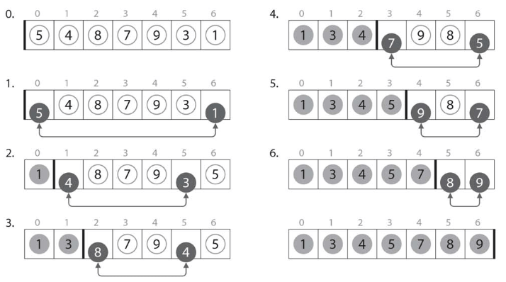

# :closed_book: 選択ソート.

:pushpin:**選択ソートの特徴.**
- 安定なソートアルゴリズムだが計算量O(nの2乗)となる. 

:pushpin:**選択ソートの手順.**

挿入、バブルソート同様に[ソート済みの部分列]と[未ソートの部分列]に分けられる.

以下の処理をN-1回繰り返す.  
:one: 未ソート部分列から最小の要素の位置minjを特定.  
:two: minjの位置にある要素と未ソート部分の先頭要素を交換.



```cpp
#include <iostream>

using namespace std;

// 選択ソート
void selection(int A[], int N) {
    
    int minj, tmp;
    
    // i:未ソート部分の先頭を表すループ変数
    // 配列Aの先頭から末尾に向けて移動.
    for (int i = 0; i < N - 1; i++) {
        // 各ループ処理でi番目からN-1番目迄の要素で最小要素の位置.
        minj = i;
        // j:未ソート部分から最小要素の位置(minj)を探すためのループ変数.
        for (int j = i; j < N; j++) {
            // minjの隣り合う要素がminj要素より小さければminjを入れ替える.
            if (A[j] < A[minj]) {
                minj = j;
            }
        }
        // 未ソート部分の先頭(i)要素は一時領域へ.
        tmp = A[i];
        // 未ソート部分の最小要素(minj)と未ソート部分の先頭要素を入れ替える.
        A[i] = A[minj];
        A[minj] = tmp;
    }
}
```

:mag_right:対象ソースは以下に格納.
```
/source/1.sort/select.cpp
```