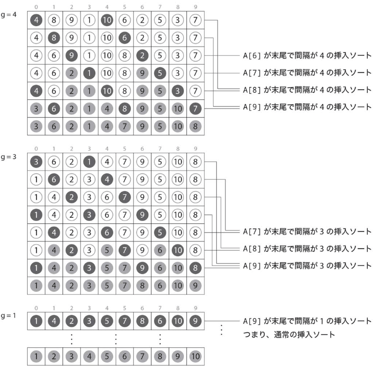

# :closed_book: シェルソート.

:pushpin:**シェルソートの特徴.**
- ほぼ整列されたデータに対して高速に動作するという挿入ソートの特徴を活かす高速なアルゴリズム.
- 一定間隔離れた要素のみを対象とした挿入ソート.

:pushpin:**シェルソートの手順.**

一定間隔g{4,3,1}を用いたシェルソートは以下の通り.



```cpp
#include <iostream>
#include <vector>

using namespace std;

long long cnt;
vector<int> G;

// 挿入ソート
void insertSort(int A[], int N, int g) {
    
    // 間隔gを指定した挿入ソート.
    for (int i = g; i < N; i++) {
        int tmp = A[i];
        int j = i - g;
        while (j >= 0 && A[j] > tmp) {
            A[j + g] = A[j];
            j -= g;
            cnt++;
        }
        A[j + g] = tmp;
    }
}

// シェルソート
void shellSort(int A[], int N) {
    // 数列Gを生成.
    for (int h = 1; ; ) {
        if (h > N) {
            break;
        }
        G.push_back(h);
        h = 3*h + 1;
    }
    
    // 逆順にG[i]=gを指定.
    for (int i = G.size()-1; i >= 0; i--) {
        insertSort(A, N, G[i]);
    }
}
```

:mag_right:対象ソースは以下に格納.
```
/source/1.sort/shell.cpp
```
