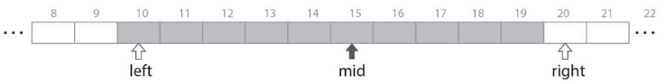
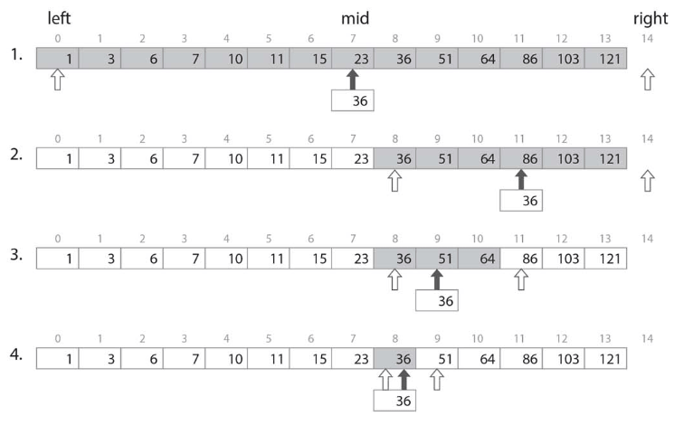

# :blue_book: 二分探索.

:pushpin:**二分探索の特徴.**
- Sの要素が昇順ソートされている制約を利用した二分探索は計算量O(log2N).

:pushpin:**二分探索の手順.**

二分探索では探索範囲を表すための変数left、right、中央の位置をmidを定義.

  

昇順ソートされた整列に対して対象要素を二分探索する場合は以下のとおり.

  

探索範囲の真ん中midを(left+right)/2で求め、keyと真ん中の要素を比較.

```cpp
#include <iostream>

using namespace std;

int S[] = {1, 2, 3, 5, 6, 7, 8, 11, 19, 20, 44, 90};
int n = 12;

// 二分探索
int binarySearch(int key) {
    
    int left = 0;
    int right = n;
    int mid;
    
    while (left < right) {
        mid = (left + right) / 2;
        
        // 中間要素とkeyが同一の場合
        if (key == S[mid]) {
            return 1;
        // 後半部分を検索させるよう制御
        } else if (key > S[mid]) {
            left = mid + 1;
        // 前半部分を検索させるよう制御
        } else {
            right = mid;
        }
    }
    return 0;
}
```

最悪の場合の計算量はO(n).

```cpp
int main(int argc, char** argv) {
    
    int T[] = {4, 8, 1, 88, 43, 7, 9, 3, 90};
    int q = 9;
    int sum = 0;
    
    for (int i = 0; i < q; i++) {
        if (binarySearch(T[i]) == 1) {
            sum++;
        }
    }
    cout << sum << endl;
    return 0;
}
```

:mag_right:対象ソースは以下に格納.
```
/source/3.search/binary.cpp
```