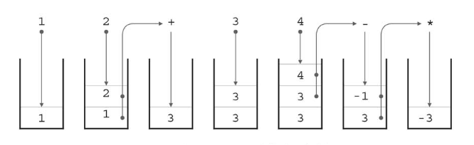

# :orange_book: スタック.

:pushpin:**スタックの特徴.**
- 一時的にデータを退避したい時に有効なデータ構造で、LIFOの原則に従ったデータ構造.

:pushpin:**スタックの手順.**

:one:push(x):スタックのトップに要素xを追加.  
:two:pop():スタックのトップから要素を取り出す.  
:three:isEmpty():スタックが空かどうかを調べる.  
:four:isFull():スタックが満杯かどうかを調べる.  

逆ポーランド記法で記述された数式は、スタックを用いて計算が可能.



pushは最後尾に要素追加、popは最後尾から要素取得.
```cpp
int top, S[1000];

// 要素の追加
void push(int x) {
    // topを加算して要素挿入.
    S[++top] = x;
}

// 要素の取得
int pop() {
    top--;
    // indexがtopの要素取得
    return S[top+1]; 
}
```
スタック操作の計算量はpop、pushともにO(1)となる.
```cpp
int main(void){
    
    vector<string> strList = { "7", "3", "+", "10", "8", "-", "7", "4", "*" };
    
    int a, b;
    top = 0;
    
    for (int i = 0; i < strList.size(); i++) {
        if (strList[i] == "+") {
            a = pop();
            b = pop();
            cout << a + b << endl;
            push(a + b);
        } else if (strList[i] == "-") {
            b = pop();
            a = pop();
            cout << a - b << endl;
            push(a - b);
        } else if (strList[i] == "*") {
            a = pop();
            b = pop();
            cout << a * b << endl;
            push(a * b);
        } else {
            int num = stoi(strList[i]);
            push(num);
        }
    }
    printf("%d\n", pop());
    return 0;
}

```

:mag_right:対象ソースは以下に格納.
```
/source/2.structure/stack.cpp
```